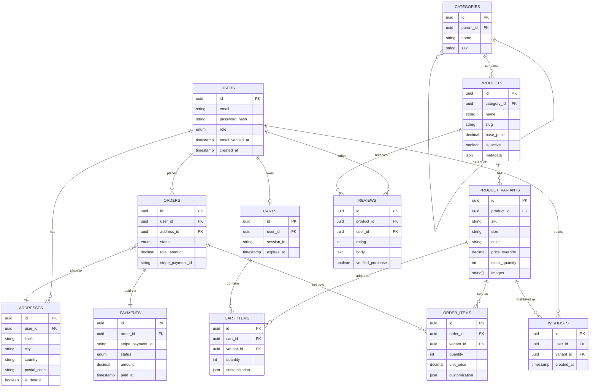

# 🛠️ Backend — DIVA Shop API
 
> NestJS REST API with PostgreSQL, Prisma ORM, Stripe, and Redis.
 
---

## Tech Stack
 
| Tool | Purpose |
|---|---|
| **NestJS** | Modular TypeScript framework (runs on Express) |
| **PostgreSQL 16** | Primary database |
| **Prisma ORM** | Type-safe queries and migrations |
| **Redis** | Caching, rate limiting, BullMQ queues |
| **Stripe** | Payment processing + webhooks |
| **Passport.js + JWT** | Authentication |
| **Swagger** | Generating and Testing backend API |

---

## Database ERD
 

 
---

## Setup
 
### Prerequisites
 
```bash
node --version   # v20+
psql --version   # PostgreSQL 15+
```
 
### Install
 
```bash
cd backend
pnpm install
cp .env.example .env    # fill in your values
```

### Database
 
```bash
# Run migrations + generate client
npx prisma migrate dev --name init
npx prisma generate

# Enable full-text search indexes
psql $DATABASE_URL -f prisma/search-indexes.sql
```

```bash
pnpm run start:dev    # http://localhost:3001/api
```
Swagger docs → `http://localhost:3001/api/docs`
 
---